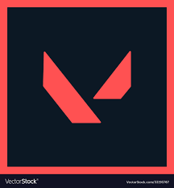
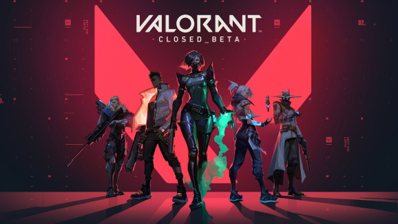
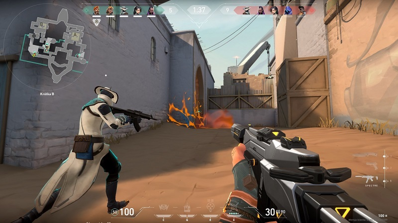
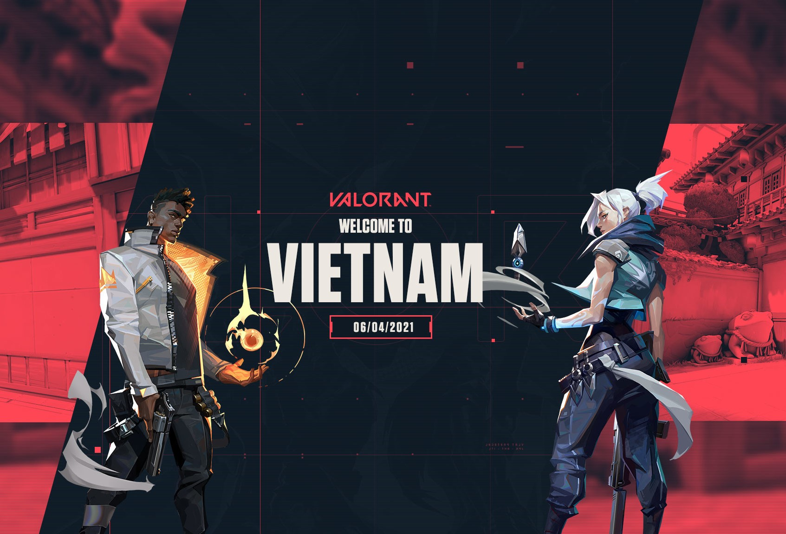

<html>
    <head><title>Giới thiệu bản thân</title>
        
    </head>
<body>
    <meta charset="utf-8">
    
    <h1 style="color:red;">Giới thiệu bản thân</h1>
    
    <h4>Họ và tên: Đinh Trọng Đức</h4>
    <h4>Sinh viên Cao Đẳng FTC</h4>
    <h4>Lớp 22CĐĐH</h4>
    <h4>Quê quán: Ninh Bình</h4>
    <h4>Địa chỉ: số 2 ngõ 18 Kiều Mai, Phúc Diễn, Bắc Từ Liêm, Hà Nội</h4>
    <h4 style="color:red;">Hành trình lên Hà Nội</h4>
    
Sinh ra và lớn lên tại miền đất Ninh Bình, 2022 đặt chân lên đất Hà Nội để theo học ngôi trường Cao đẳng ngoại
        ngữ và công nghệ Hà Nội (FTC). Đặt cọc và thuê trọ tại hộ gia đình bác Tuyền Tâm tại số 20 ngõ 2 Kiều Mai - Phúc Diễn,
        sau 1 tháng ở tại gia bác Tuyền Tâm thì em với đứa cùng phòng mới biết được sự thật ẩn dấu sau vẻ mặt tri thức của bác Tuyền Tâm 
        là 1 con người dối trá và đã lừa ghi thêm vào hợp đồng thời hạn ở 5 năm trong khi bản thân em chỉ học ở trường 2 năm rưỡi. bức xúc, đau đơn và
        gục ngã nên bọn em đã bỏ luôn tiền cọc và tự xách đồ đi, coi như 1 trải nghiệm đáng nhớ của tháng đầu tiên ở đất Hà Nội này. em viết lên những dòng
        này chỉ để muốn nói rằng: số nhà 20 ngõ 2 Kiều Mai bác Tuyền Tâm vẫn đang còn phòng và tiếp tục lùa thêm những con cừu non sinh viên non nớt dính bẫy.
    

</body>
<body>
    <h4 style="color:red;">Bảng liệt kê quá trình học tập</h4>
<meta charset="utf-8">
    <table style="width:60%">
        <tr>
          <td>Tiểu học</td>
          <td>2010-2015</td>
          <td>Trường tiểu học Gia Sơn</td>
        </tr>
        <tr>
          <td>Trung học cơ sở</td>
          <td>2015-2019</td>
          <td>Trung học cơ sở Lê Hồng Phong</td>
        </tr>
        <tr>
          <td>Trung học phổ thông  </td>
          <td>2019-2022</td>
          <td>Trung học phổ thông Lê Hồng Phong</td>
        </tr>
         <tr>
          <td>Sinh viên</td>
          <td>2022-2025</td>
          <td>Sinh viên cao đẳng FTC</td>
        </tr>
      </table>
    
        <dl>  
            <dt><h4 style="color:red;">Danh sách sở thích:</h4></dt>
        </dl>
            <ol>
                <li>ngủ quá giờ trưa</li>
                <li>chơi mô hình</li>
                <li>ăn uống tẹt ga</li>
                <li>chơi game</li>
                <li>vi vu đi chơi</li>
            </ol>
    <h4 style="color:red;">Các tựa game yêu thích</h4>
  </body>
    <body>
        
        

            

        

          
        

            

        

          
        

            
        

        

            

        

          
        

            
        

          
        

            

        

    </body> 
<body>
    <h1 style="color:red;" id="CV">Valorant</h1>
    <h3>Tựa game chiến thuật bắn súng góc nhìn thứ nhất của nhà Riot Games </h3>
    
    
Trò chơi được công bố lần đầu tiên với tên mã là Project A vào tháng 10 năm 2019. Nó được thiết lập để phát hành   
    cho Microsoft Windows với phiên bản Closed beta ra mắt vào ngày 7 tháng 4 năm 2020, sau đó là phát hành chính   
    thức vào ngày 2 tháng 6 năm 2020. Tại Việt Nam, Valorant được phát hành vào ngày 6 tháng 4 năm 2021.
    Valorant   là một game bắn súng chiến thuật online theo đội 5 vs 5 và là game FPS lấy bối cảnh trong một tương lai gần. Người   
    chơi điều khiển các Đặc vụ (Agent) đến từ rất nhiều quốc gia và nền văn hóa trên thế giới
       
     
    
    
</body>
</html>
